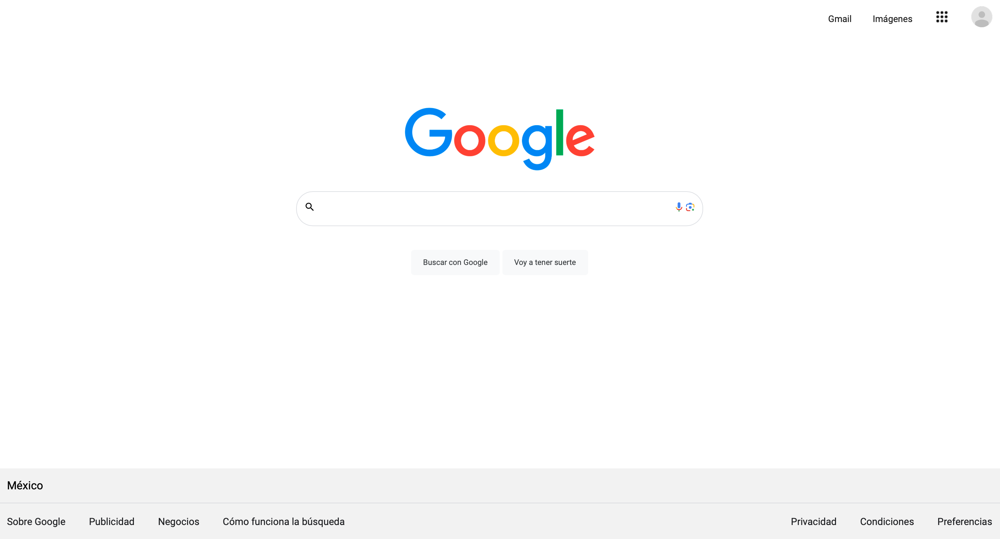

# Proyecto: Clon de Google, para TECNOLOCHICAS PRO

El presente proyecto es una actividad realizada dentro del bootcamp de desarrollo frontend de Technolochicas PRO con el fin de conocer la composición de uno de los buscadores más importantes de la actualidad, Google.

Fue desarrollado de 0 con HTML y CSS.

[Proyecto desplegado](https://clon-google.netlify.app)

## Vista previa del sitio

## Tecnologías
* HTML
* CSS

---

Desarrollado con 💟 por [Evelyn](https://evelynperea.netlify.app) en [TECHNOLOCHICAS PRO](https://tecnolochicas.mx)